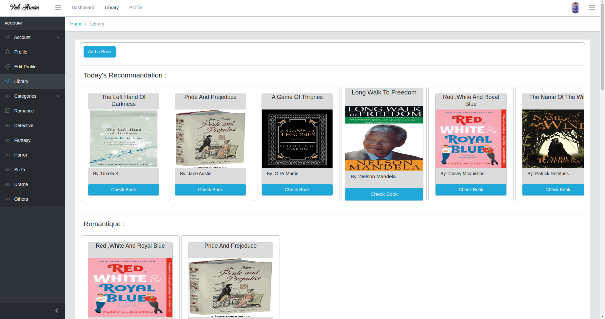
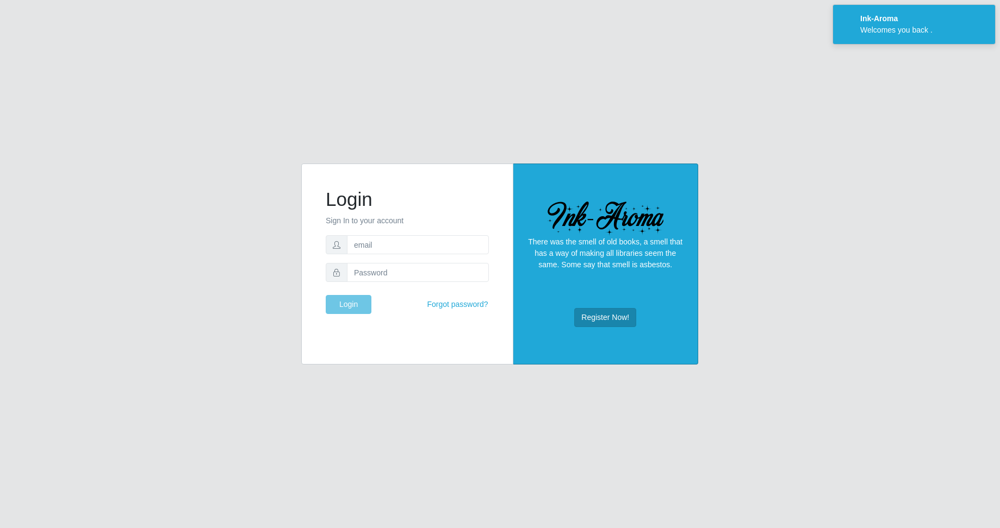
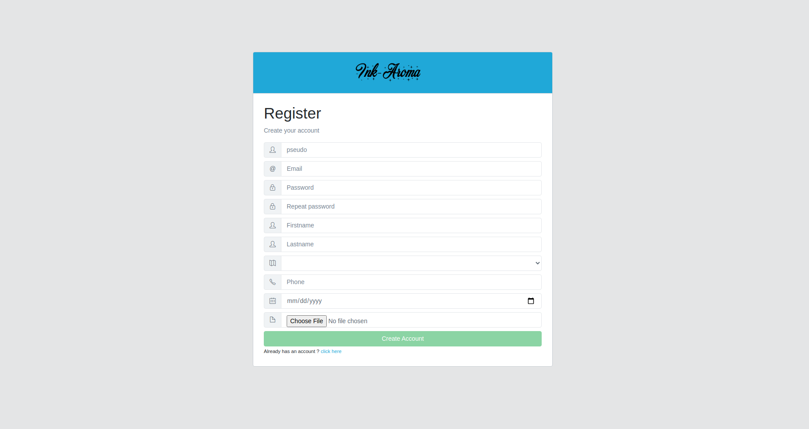
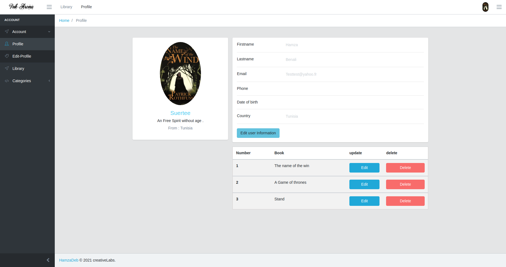
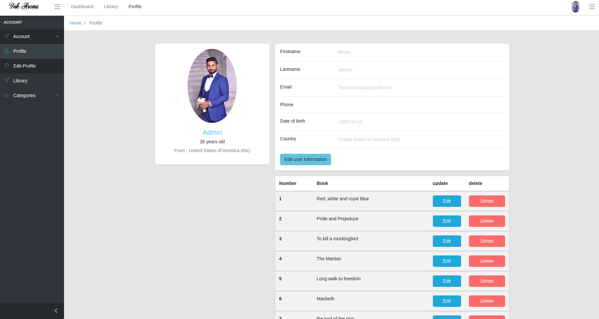
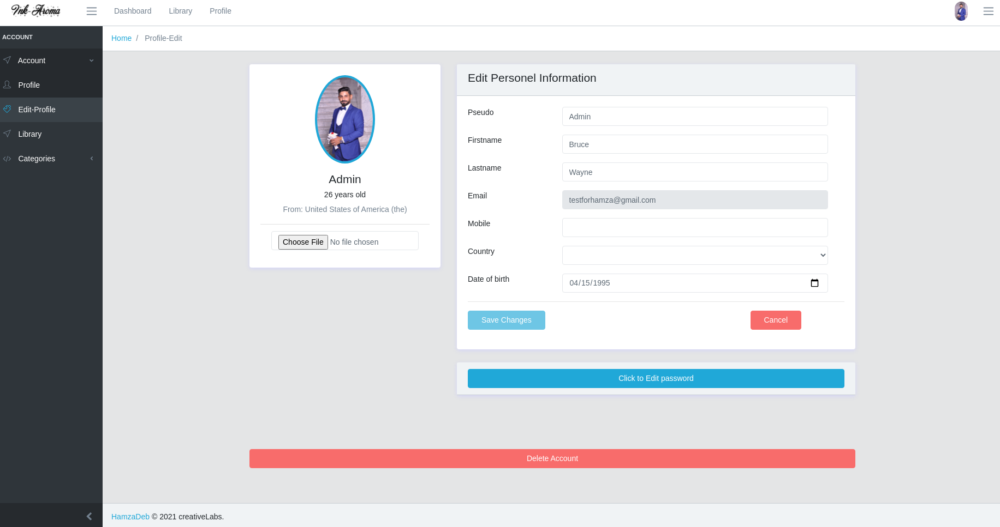
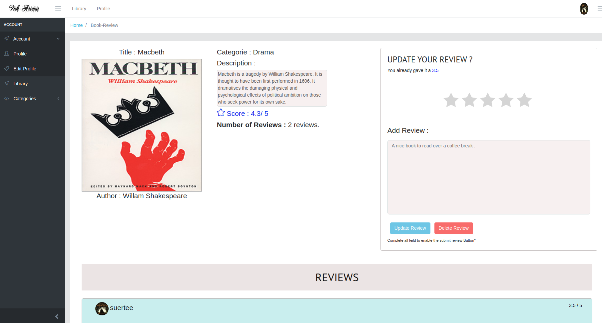
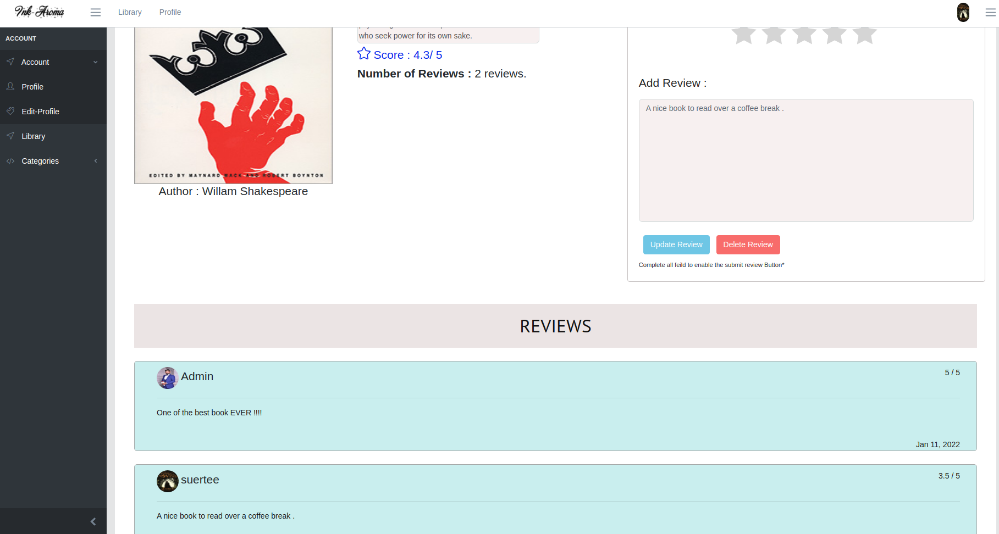

# HowToSTart

1/ npm install

# for_this_to_work

1/ You are gonna have to download the backEnd side of the InkAroma . 
2/ you are gonna need to install mongoDB

# Tips

1/ if you want to check the SuperAdmin dashboard , change the email in the html default layout (col 11) and in the admin guard 
2/the intial data base is empty ,so it would be very usefull to add a couple books if you wanna experience
the full potential of the platform and see how it works .

# About the Project

This is A friendly users platform , an open source library of books that any user may: 
1/ Create his own profile and authenticate (login ) to the platform . 
2/ Crud the profile.  
3/ Check all the library of books either as a whole or by categories. 
4/ Access a specifique book , read it's infos , check the score and reviews added by other users.   
5/ add a book 
6/ add a score , review and update those two options to a specifique book  
7/ access to other user profile and infos made available by them for other users to see 

### ScreenShots :

|                 _Home_                 |               _login_               |                     _Registration_                     |                _Profile 1_                |              _Profile 2_               |                     _Edit Profile_                      |                 _Reviews_        |          _Reviews2_
| :-------------------------------------------: | :----------------------------------: | :------------------------------------------------: | :-----------------------------------------: | :-----------------------------------------: | :-----------------------------------------------: | :-----------------------------------------: | :-----------------------------------------------: |
|  |  |  |  |  |  |  |  |

